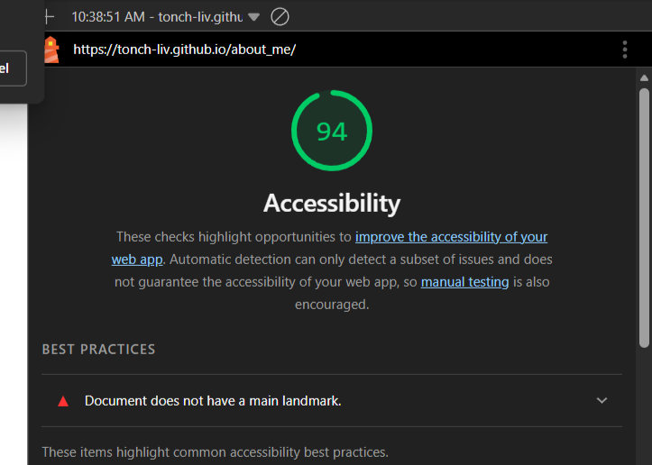
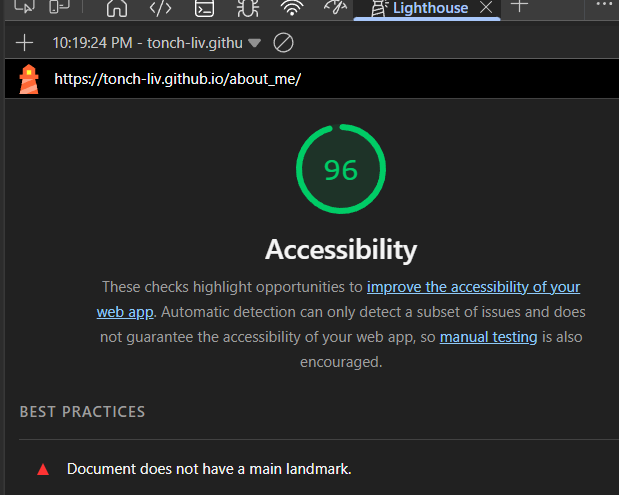

# about_me

- 02.03.2026  
  - will contain lorem text on main index.html page, until being updated, while asking the user 5 questions using javascript.
  - added lorem and overall structure for future sections (biography, pictures, etc.).
  - added 4 questions.

- 02.04.2026
  - added fifth question.
  - added user greeting with name response (currently commented out while tshooting name return).
  - added screenshot of lighthouse accessibility generated report below.
  - added section titles for future content as `h2` headings.
  

- 02.08.2026
  - added work exp and education us unorder lists.
  - added top ten ordered list.
  - fixed some spelling and prompt responses.
  - added sixth question, guessing game; in midst of annotating for legibility.

- 02.09.2026
  - edited guessing game prompt output.
  - added seventh question, console message and tested funtionality.
  - added core tally for seven questions.
  - could not run lighthouse/accesibility check; will try tomorrow in class.

- 02.10.2026
  - have researched the cause for lighthouse issues, will comment/unlink js and retry.
    - Antonio was the Navigator, Amity was the driver.
    - added functions to questions, traits,game,tally.
  - commented out script element to not link js file and run lighthouse report, will push and test.
  - lighthouse report generated, js link ack up and active, and screenshot added below.
  

- 02.21.26
  - forgot to update on last editing session, but started adding styling as well as biography section.
  - added `reset.css` and refactored existing css.
  - continued styling and replaced lorem with actual text.
  - reset headings styling after `reset.css` nullified.

---

- Completed
  - Lab_02
    1. Task: Guessing Game
        - Create About Me guessing game that utilizes HTML, CSS, & JavaScript. Five yes/no questions through prompt button input, that alerts user if question is answered correctly.
        - console.log() messages notify user if correct.
        - Include on your HTML page a short biography, your education history, an overview of your job experience, and any goals that you may have.
    2. Task: Welcome Msg
        - Ask the user their name through a prompt(), Display name back to user through a custom greeting welcoming them to site.
        - Display the user’s name back to them in your final message to the user.
    3. Task: Using Lighthouse in the Chrome DevTools, analyze the accessibility of your application.
        - 02.04.2026 ^^
  - Lab_03
    1. Task: Create list
        - “Top Ten” at bottom of page as an ordered list in HTML (fruit).
        - work experience and education summary into an unordered list using HTML.
    2. Task: 6th question to guessing game that takes numeric input by prompting the user to guess a number.
    3. Task: 7th question with multiple possible correct answers that are stored in an array.
    4. Task: Final score tally.
    5. Task: Lighthouse - 02.10.2026.
  - Lab_04
    1. Pair Programming.
  - Lab_05b
    1. Finish About me.
        - wip
